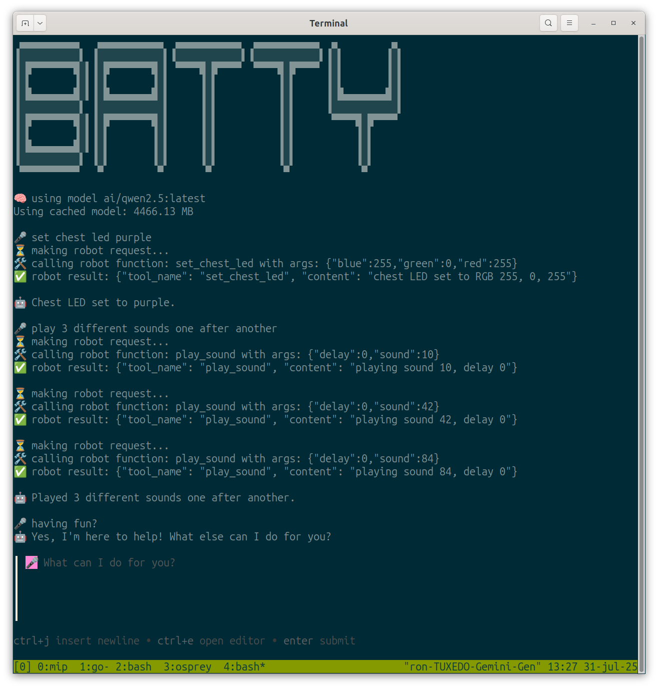

# batty

Command line interface to real robots, drones, and other devices that provide an MCP server interface.

Supports multiple step interactions for models that can perform such actions.

Written using [Osprey](https://github.com/k33g/osprey) on [bash](https://en.wikipedia.org/wiki/Bash_(Unix_shell)).

## Using

You must have any robot MCP servers already running in order to run Batty.

Then just run the `batty.sh` command.

### Additional command options

Coming soon...

## Installing

- jq - A lightweight and flexible command-line JSON processor.
- awk - A domain-specific language designed for text processing.
- curl - A command-line tool for transferring data with URLs.
- bash - A Unix shell and command language.
- gum - A tool for creating interactive command-line applications.
- osprey - A lightweight Bash library for interacting with the DMR (Docker Model Runner) API.
