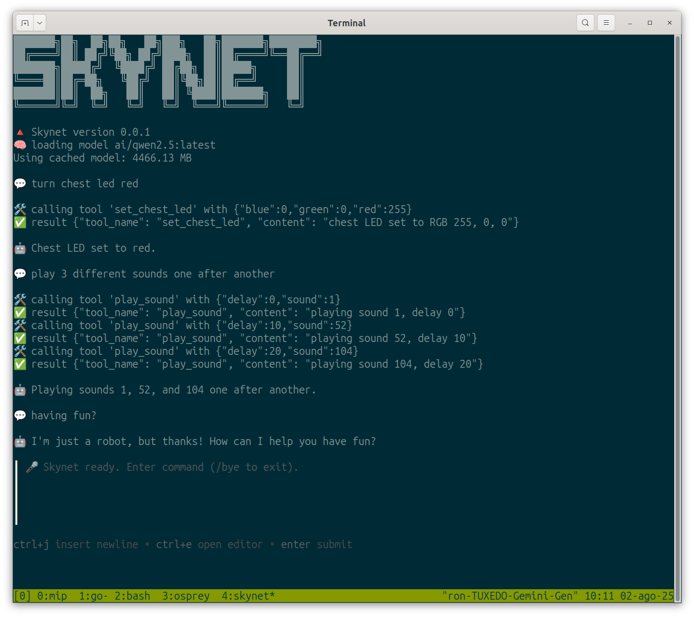
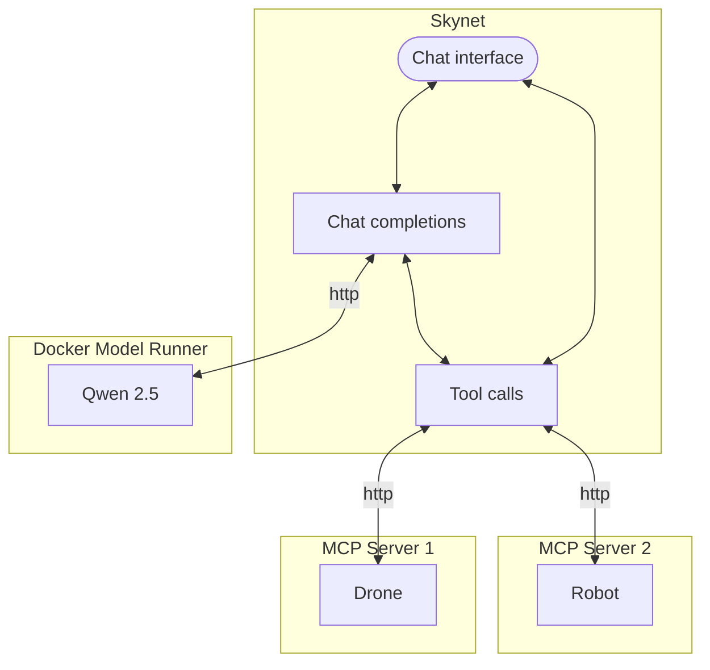
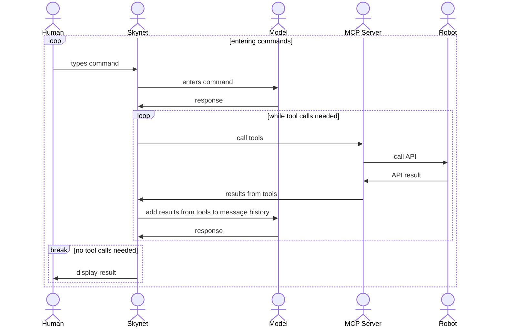

# Skynet

## 🔺 What is Skynet

Skynet is a minimal command line interface for Large Language Models to control real robots. 

It provides an [MCP host](https://modelcontextprotocol.io/docs/learn/architecture) that calls [Docker Model Runner](https://www.docker.com/products/model-runner/) to control robots, drones, and other devices that provide an [MCP server](https://modelcontextprotocol.io/docs/learn/server-concepts) interface.

Skynet supports multiple step interactions for models that can perform such actions such as [Qwen 2.5 Instruct](https://hub.docker.com/r/ai/qwen2.5).



## 🔺 How Skynet works

Skynet is written in [bash](https://en.wikipedia.org/wiki/Bash_(Unix_shell)) using [Osprey](https://github.com/k33g/osprey).

### Architecture



### User flow




## 🔺 Using Skynet

You must have any robot MCP servers already running in order to run Skynet. See [ROBOTS.md](ROBOTS.md) for a list of some known physical devices with MCP server interfaces.

Then just run the `skynet.sh` command.

### Additional command options

You can set the following environment variables to change Skynet.

🔺 `DEBUG_MODE`

Set debug mode. Defaults to `false`

🔺 `MCP_SERVER`

Set the MCP server to use. Defaults to `http://localhost:9090`

🔺 `MODEL_RUNNER_BASE_URL`

Set the URL to call Docker Model Runner.

🔺 `MODEL_RUNNER_TOOL_MODEL`

Set the model to use. Defaults to `ai/qwen2.5:latest`

🔺 `MODEL_RUNNER_TEMPERATURE`

Set the temperature for the model. Defaults to `0.0`

🔺 `OSPREY_INSTALL`

Set the directory in which to find Osprey. Defaults to your home directory.

🔺 `SYSTEM_INSTRUCTION`

Set the system instruction. Defaults to:

```
You are a robot.
You have tools that actually call devices in the physical world that you are connected to.
Use your tools to respond to human requests.
Keep your responses short and to the point.
```

## 🔺 Installing Skynet

You can use Skynet with the [Docker Model Runner](https://www.docker.com/products/model-runner/) with any model that supports instructions.

[Qwen 2.5 Instruct](https://hub.docker.com/r/ai/qwen2.5) is known to work. Others may as well...

You also need to install the following:

🔺 jq - A lightweight and flexible command-line JSON processor.

🔺 awk - A domain-specific language designed for text processing.

🔺 curl - A command-line tool for transferring data with URLs.

🔺 bash - A Unix shell and command language.

🔺 [gum](https://github.com/charmbracelet/gum) - A tool for creating interactive command-line applications.

🔺 [osprey](https://github.com/k33g/osprey) - A lightweight Bash library for interacting with the DMR (Docker Model Runner) API.
